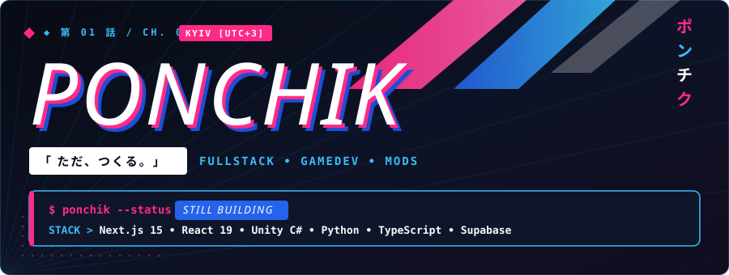
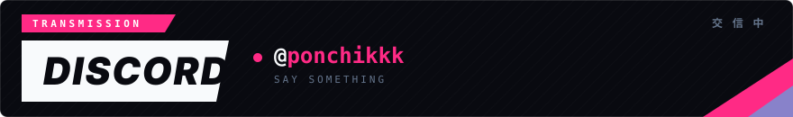

  <!-- Top Main Banner -->
  

  <!-- Middle Row: Timezone + Status -->
  

    

  <!-- Transmission / Discord Banner -->
  

    

  <!-- Fast Status Badges -->
  

    
    
    
  

---

### ⚡ OVERVIEW

- 🌌 **Primary Project:** Автор и архитектор **[Zoovix](https://github.com/Ponchik0/Zoovix)** *(Временно отключен — в процессе масштабной переработки архитектуры)* — современная медиа-платформа и кинокаталог с синхронизированными комнатами совместного просмотра, квестовой системой, сессионной защитой и PWA.
- 🌐 **Personal Website:** Создатель интерактивного **[Портфолио](https://ponchik0.github.io/portfolio/)** на Astro, Tailwind CSS и TypeScript с поддержкой i18n (EN/RU) и плавной анимацией.
- 🛠️ **Client Systems & Developer Tooling:** Проектирование веб-интерфейсов, интеграций с внешними API, систем аналитики и инструментов автоматизации.

---

### 🛰️ TECH STACK & ARCHITECTURE

#### Frontend & Core Web

  
  
  
  
  
  

#### Backend, Databases & Cloud

  
  
  
  
  

#### Tooling & Workflow

  
  
  
  

---

### 📦 FEATURED PROJECTS

<table>
  <tr>
    <td width="50%" valign="top">
      <h3 align="center">🎬 Zoovix</h3>
      

        
      

      

        
        
      

      
Медиа-каталог и стриминговая экосистема с комнатами совместного просмотра в реальном времени, квестами прогресса, защищенной сессионной авторизацией и PWA.

      

        <em>⚙️ Проект переписывается на новую масштабируемую архитектуру</em>
          
        <a href="https://github.com/Ponchik0/Zoovix"><strong>[ Исходный код на GitHub ]</strong></a>
      

    </td>
    <td width="50%" valign="top">
      <h3 align="center">✨ Personal Portfolio</h3>
      

        
      

      

        
        
      

      
Персональный сайт с чистым интерфейсом, поддержкой переключения языков (EN/RU), анимациями при скролле и автоматическим деплоем через GitHub Pages.

      

        <a href="https://ponchik0.github.io/portfolio/"><strong>[ Открыть сайт ]</strong></a> • 
        <a href="https://github.com/Ponchik0/portfolio"><strong>[ Репозиторий ]</strong></a>
      

    </td>
  </tr>
</table>

---

### 🔥 ACTIVITY & STREAK

  

 

  

---

### 🌊 3D CONTRIBUTION WAVE

  

---

  
  
  

  

